# 🚀 Pulse Protocol — LinkedIn Launch & Architecture Kit

This kit provides complete visual assets, architecture flowcharts, and optimized post copies for announcing **Pulse** on LinkedIn.

---

## 🎨 Visual Assets (Generated for Your Post)

### 1. The Pulse Protocol Hero Banner

*Ideal for:* Main post image, LinkedIn article header, or profile banner.

---

### 2. The 4-Stage Flywheel Architecture Infographic

*Ideal for:* Second carousel slide, technical breakdown post, or investor pitch deck.

---

## 📊 High-Level System Flowcharts

### Flowchart 1: The Two-Sided Problem vs. The Pulse Flywheel

```
┌────────────────────────────────────────────────────────────────────────┐
│                        THE DOUBLE-SIDED PROBLEM                        │
│                                                                        │
│   ❌ The "Dead Capital" Blindspot      ❌ The "Cold-Start" Illiquidity │
│   • Finalized 15-min contracts drop   • New rolling windows launch     │
│     out of standard indexers.           with EMPTY order books.        │
│   • Retail winnings sit stranded on   • Market makers face toxic flow  │
│     chain, forgotten by users.          & wide 10-20% spreads.         │
└──────────────────────────────────┬─────────────────────────────────────┘
                                   │
                                   ▼
┌────────────────────────────────────────────────────────────────────────┐
│                        THE PULSE SOLUTION                              │
│                                                                        │
│   1. CAPITAL RADAR ──────────▶ 2. AUTO-RECYCLE FLOW                    │
│   • Audits finalized markets   • 1-Click atomic redeemMany()           │
│   • Proves settlement on       • Channels recovered tUSDC into         │
│     Somnia Oracle Graph          autonomous quoting vault              │
│               │                                   │                    │
│               ▼                                   ▼                    │
│   4. ON-CHAIN ATTESTATION ◀─── 3. QUANTITATIVE QUOTING                 │
│   • Hashes sealed on-chain     • Black-Scholes Digital Call N(d2)      │
│   • PulseAudit.sol on Somnia   • Avellaneda-Stoikov inventory skew     │
│   • Brier calibration feedback • Zero-inventory pair minting           │
└────────────────────────────────────────────────────────────────────────┘
```

---

### Flowchart 2: Detailed Technical Architecture (Mermaid)

```mermaid
flowchart TD
    subgraph Client ["🖥️ Web Terminal (Next.js 14 + Tailwind + RainbowKit)"]
        Landing["Landing Page / Flywheel"]
        RadarUI["Capital Radar (/claims)"]
        AgentUI["Quoting Terminal (/agent)"]
        Charts["Recharts Brier Reliability Curve"]
    end

    subgraph Core ["🧠 Pulse Quantitative Core (@pulse/core)"]
        BS["Black-Scholes Engine: N(d2)"]
        EWMA["Rolling EWMA Realized Volatility"]
        AS["Avellaneda-Stoikov Skewing Engine"]
        Brier["Brier Calibration Engine: Σ(f-o)²"]
        Scanner["Finalized Binary Indexer Bypass"]
    end

    subgraph Daemon ["🤖 Autonomous Quoting Worker (agent-worker)"]
        Loop["15-Second Continuous Loop"]
        PairMinter["Dual postOnly Limit Buys (Zero-Inventory)"]
        Bridge[".pulse-telemetry.json Live State Bridge"]
    end

    subgraph SomniaShannon ["⚡ Somnia Shannon L1 (Chain ID: 50312)"]
        DEX["DreamDEX CLOB Event Contracts"]
        Oracle["Somnia Production Oracle Graph"]
        Contract["PulseAudit.sol (0xba2b...2264)"]
    end

    RadarUI -->|"1. Scans Finalized Contracts"| Scanner
    Scanner -->|"Direct Query"| DEX
    RadarUI -->|"Inspect Settlement Proof"| Oracle
    RadarUI -->|"2. One-Click Batch Redemption"| DEX
    
    Loop -->|"3. Computes Fair Value & Skew"| Core
    Loop -->|"4. Dual postOnly Quotes"| DEX
    Loop -->|"5. Seals Decision Hash"| Contract
    Loop -->|"Persists Live Telemetry"| Bridge
    Bridge -->|"Real-Time Metrics"| AgentUI
    Core -->|"Draws Calibration Diagnostics"| Charts
```



---

## 📝 LinkedIn Post Drafts (Ready to Copy & Paste)

### Option 1: The Builder Narrative (High Engagement & Virality)
> Recommended for maximum reach, story engagement, and showcasing what you built.

```text
Short-window prediction markets have a silent multi-million dollar problem that almost no one is talking about. 📉

In 15-minute crypto event contracts (like BTC and ETH Up/Down bets), when a contract settles:
1️⃣ Standard indexers immediately drop it from frontend catalogs.
2️⃣ Users close their tabs and leave winning payouts stranded on-chain forever.
3️⃣ Meanwhile, the very next 15-minute window launches with an EMPTY order book and zero liquidity.

This creates a vicious cycle: dead capital sits trapped while fresh markets starve.

To fix this, my team and I built ⚡ PULSE — the Closed-Loop Liquidity & Capital Recycling Protocol for DreamDEX on Somnia Network.

Here’s how the Pulse Flywheel works:

🔍 1. Capital Radar: Bypasses standard catalog blindspots to audit finalized binary contracts directly on Somnia Shannon, discovering unredeemed winnings and linking directly to cryptographic proof on the Somnia Production Oracle visualizer.

🔄 2. One-Click Auto-Recycle: Rather than letting winnings sit idle in a wallet, a single atomic transaction triggers `redeemMany()` and instantly deploys that capital into our autonomous quoting vault. Passive traders become active spread earners.

📐 3. Quantitative Quoting Engine: Instead of naive mid-price following, our quoting daemon prices dual-sided quotes using closed-form Black-Scholes cash-or-nothing digital option delta: P(Up) = N(d2), powered by rolling EWMA realized volatility.

🛡️ 4. Avellaneda-Stoikov Inventory Skewing: If one leg fills asymmetrically, the protocol dynamically skews its reservation price to attract counter-takers and complete the zero-inventory pair before the lock window, eliminating adverse selection.

📜 5. On-Chain Decision Attestation: Every single forecast, spot price, and Brier score is hashed via SHA-256 and permanently sealed into our verified smart contract (PulseAudit.sol) on Somnia Shannon L1 before market expiry.

The results?
✅ 100% testnet verified on Somnia Shannon (Chain 50312)
✅ Verified PulseAudit.sol contract deployed
✅ Live production terminal running on Vercel
✅ 120+ granular git commits showing the full engineering journey

Check out the live links below and let me know your thoughts! 👇

🌐 Live Web Terminal: https://pulse-iota-one-81.vercel.app
📜 Verified Contract on Somnia Explorer: https://shannon-explorer.somnia.network/address/0xba2b8f1b8f7a4a361e0fdf98410929a55b9e2264
💻 GitHub Repository: https://github.com/divyansh-v15-06/pulse

Built for the Somnia Network × DreamDEX Event Contracts Hackathon on DoraHacks. 🚀

#Web3 #DeFi #Somnia #Crypto #PredictionMarkets #QuantitativeFinance #BuildInPublic #Fintech #Ethereum #SmartContracts #Solidity
```

---

### Option 2: The Quantitative Systems Deep-Dive (Technical Focus)
> Recommended if your network consists of engineers, quant researchers, or venture analysts.

```text
How do you build a zero-inventory market maker for 15-minute binary event contracts on an ultra-high-throughput L1? ⚡

While building for the Somnia Network × DreamDEX Hackathon, we tackled the microstructural friction of short-duration prediction markets.

Here is the technical architecture behind PULSE Protocol:

1. Microstructure & Zero-Inventory Pair Minting:
DreamDEX allows continuous pair-minting when opposing buy orders meet. By posting dual `postOnly` limit buys on UP and DOWN, Pulse captures the bid-ask spread risk-free without holding directional inventory.

2. Analytical Pricing via Black-Scholes Digital Option Delta:
Binary markets resolve to 1 or 0. The theoretical risk-neutral probability of settlement above strike is given by:
P(Up) = N(d2)
where d2 = [ln(S/K) + (r - 0.5 * σ²) * τ] / (σ * sqrt(τ))
• Spot S & Strike K: Sourced directly from internal oracle candles scoped to [tradingStart, expiry] to eliminate external latency.
• Volatility σ: Calculated via exponentially weighted moving average (EWMA) with λ = 0.94.

3. Toxic Flow Protection via Avellaneda-Stoikov:
When rapid momentum fills only the UP leg, Pulse dynamically adjusts its reservation price:
Bid(Down) += Δ_skew
Bid(Up) -= Δ_penalty
This attracts takers to complete the pair, while a strict 300s pre-expiry cutoff eliminates tail risk.

4. Statistical Calibration Loop (Brier Score):
Brier = (1/N) * Σ(predicted_prob - actual_outcome)²
Tracked via an interactive Recharts reliability diagram. If predictive drift exceeds 0.20, our dynamic spread controller automatically widens quotes up to 2.0x.

5. On-Chain Decision Attestation (PulseAudit.sol):
Every state vector is hashed via Keccak256 and attested to Somnia Shannon L1 before resolution, creating an unfalsifiable audit trail.

Live prototype & contract details:
• Live Terminal: https://pulse-iota-one-81.vercel.app
• Verified Contract: https://shannon-explorer.somnia.network/address/0xba2b8f1b8f7a4a361e0fdf98410929a55b9e2264
• Open-Source Monorepo: https://github.com/divyansh-v15-06/pulse

Would love feedback from quants and DeFi architects! 💬

#DeFi #QuantFinance #AlgorithmicTrading #Somnia #MarketMaking #Solidity #TypeScript #Web3Engineering
```

---

## 💡 Best Practices for Your LinkedIn Post

1. **Tag relevant accounts on LinkedIn:**
   * Tag `@Somnia Network` (or search for Somnia official page)
   * Tag `@DoraHacks`
   * Tag your team/friend who collaborated on the project
2. **Media Selection:**
   * Attach **both images** as a multi-image carousel or post the `pulse_architecture_infographic` image as the main graphic. LinkedIn prioritizes posts with clear, high-contrast infographics.
3. **First Comment Strategy:**
   * Post the main copy.
   * Immediately leave a comment containing the direct links (`https://pulse-iota-one-81.vercel.app` and GitHub link), because LinkedIn's algorithm often rewards posts without external links in the primary body, or you can keep links in the body as formatted above.
